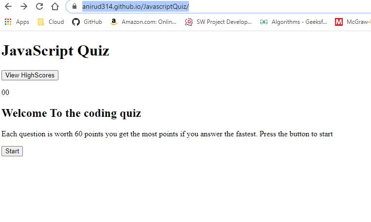
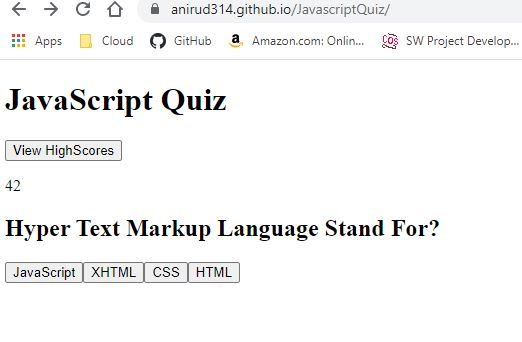
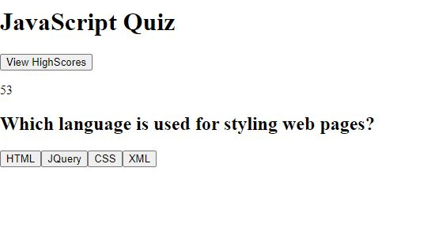
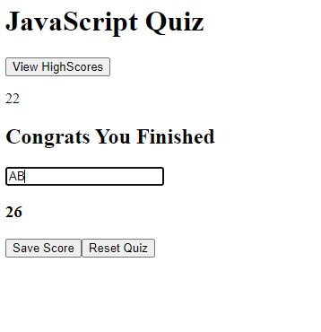
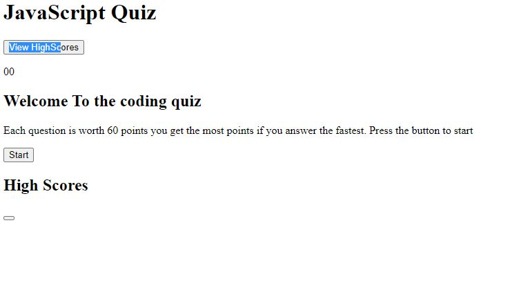
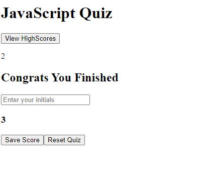

# 04 Web APIs: Code Quiz

## NOTE AS OF 11:27 PM I Finished The most that I could. I will detail what Happened in my report but I am submitting as is to make sure I get some points.

## NOTE AS OF 11:30 PM I just made my final push into the repo - Again I will go over everything in the report. But I want to have at least something to submit. Here are the 2 links https://anirud314.github.io/JavascriptQuiz/ ---- if that doesnt work try using this https://anirud314.github.io/JavascriptQuiz/index.html.

# My Report
## Summary
This weeks challenge was actually very challenging. The good I can take from it is that I understand the versitility that the DOM provides and the amount of work required to master it. The bad is that I don't think I will be able to finish the assignment on time. As of the time I started writing this (April 18th 11:35PM). I have one bug that is causing one of the features to not work and that is the persistance of the app using local storage. I need more time and some help with understanding what happened. I also was unable to touch styling the app with css as well. Lastly I wasn't able to properly comment over my code, and I will get to why it happened. I am not trying to make excuses. I just messed up one part and didnt have time to check if I was doing it correctly which led to me having to restart my project 5 hours before the deadline. 

## Initial Thoughts with what is now known as script(DoesntWork).js
I initially designed my data structure to utilize 2 for loops, one looping around the quiz object and taking and using DOM to create html elements for the question as well as iterate through the quiz to get user input. And another for loop inside of the previously mentioned one to create the multiple choice input options for each question using the options array inside of each question object inside of the quiz array. This structure made sense in my head and on paper, however there was an issue I was facing. In order to utilize eventHandlers for imbedded DOM functions that created the multiple choice options for each question I needed to return to the eventHandler using return EventHandler. The issue with doing that is that in a for loop it breaks the iteration through it if you return a value in the middle of it. I didnt remember this, nor did I know this was the problem until I talked to Dylan(T.A) about it. Thankfully he put me in the right direction but I didnt really have that much time to spare.

## Rushing to find another Solution, current script.js
Thanks to Dylan's help I was able to better understand what I made a mistake on. Instead of using a double for loop and making it complex for myself I used functions to iterate through the questions. I still used for loops to generate the multiple choice options for the quiz questions. What I first did was I created a constructor that I could use for the quiz. That constructor would create a quiz object that held a score for the quiz; the quiz questions; and the question index. I also created a constructor to create question objects that would hold a string for the question, an array of options to choose from and an answer value that holds the correct answer to the question. II also created a couple prototype functions for the object that could be utilized to check if values were true or to return compounded values easier. The driver function is the startQuiz function and it will only run once the start quiz button is pushed in the index.html. Once that Is done it will call a timerId function that is designed to set a timer for 60 seconds. The faster you get through the quiz the more bonus points you can get. the start quiz function will call the getquestion function which will iterate through the quiz object that was constructed in the script. while the quiz isnt finished the timer will still run and the code will generate one question each time the function is called based on the question index in the quiz object. When the getQuestion function generates option buttons for each question there is an event listener for each button that calls the checkAns function which takes the id of the choice made and compares the value of that choice to the value of the answer in the question object. check answer checks this using one of the prototype functions I created. once that is done it will call back into the getquestion function iterating through the quiz object using the questionIndex value until there is no more questions left, which getquestion will check using another prototype function. Once the quiz is finished, the getQuestion function calls a saveScore() which is a function that is designed to calculate the score. This function is very DOM heavy because It requires a form to take inputs and all of this is generated dynamically through javascript. Once you finish the quiz this function will tally up your score by adding the time remaining with the amount you got correct. after you get your score you can add your initials into a form input and there are two buttons that you can pick. One is the submit score button and another is the reset quiz button. The submit score button will take you to a setScore function and the reset quiz will take you to a reset quiz function. The reset quiz function just reloads the page.

## What is currently the issue with the code
Currently the issue is that I am trying to debug and figure out why the array that I make for pushing the score into the localStorage isnt working. The issue is that I think that the program is not even going into that function. By the time I got to the point where I could see this was an issue it was already 11:48pm on April 18th. And while I am planning on finishing this in my free time while I can, I want to make sure I submit what I have on time. The only issue as of right now is the data persistience is not working and I need to figure out what I did wrong.

## What is left Undone
Because I struggled so much on this part there are a couple of things that are left unkempt and undone. 

For starters I was unable to style the page on time, I ran out of time and was stuck trying to fix the issues I had which left me no time to style the page. 

The second thing Is that I was unable to take the time to clean the code up. There are still things that I randomly tried and alot of console logs that I used for debugging.

The third thing that is left undone is that there is a lack of informative comments in my code. This is mostly because of me rushing my work to try to get it done and the constand amount of deleting and redoing that I had to do. When this happens normally I take time to go over my code and detail what is going on for both myself and others after I am done with it and the program works. I always make sure I detail what is going on in the readme.md normally as well, which I did this time as well.

## Screenshots 












# Instructions
As you proceed in your career as a web developer, you will probably be asked to complete a coding assessment, which is typically a combination of multiple-choice questions and interactive challenges. Build a timed code quiz with multiple-choice questions. This app will run in the browser and feature dynamically updated HTML and CSS powered by your JavaScript code. It will also feature a clean and polished user interface and be responsive, ensuring that it adapts to multiple screen sizes.

## User Story

```
AS A coding bootcamp student
I WANT to take a timed quiz on JavaScript fundamentals that stores high scores
SO THAT I can gauge my progress compared to my peers
```

## Acceptance Criteria

```
GIVEN I am taking a code quiz
WHEN I click the start button
THEN a timer starts and I am presented with a question
WHEN I answer a question
THEN I am presented with another question
WHEN I answer a question incorrectly
THEN time is subtracted from the clock
WHEN all questions are answered or the timer reaches 0
THEN the game is over
WHEN the game is over
THEN I can save my initials and score
```

The following animation demonstrates the application functionality:


### Review

You are required to submit the following for review:

* The URL of the functional, deployed application.

* The URL of the GitHub repository. Give the repository a unique name and include a README describing the project.

- - -
© 2021 Trilogy Education Services, LLC, a 2U, Inc. brand. Confidential and Proprietary. All Rights Reserved.